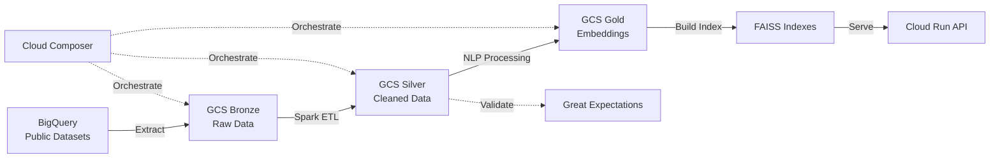

<div align="center">

# 🔍 Unstructured Intelligence Platform on GCP

[](https://github.com/yourhandle/unstructured-intel-gcp/actions/workflows/ci.yml)
[](https://www.python.org/downloads/)
[](https://opensource.org/licenses/MIT)
[](https://github.com/psf/black)

**Batch + streaming pipelines that turn raw web text into searchable, quality-checked insights on GCP**

[Features](#-features) •
[Quick Start](#-quick-start) •
[Architecture](#-architecture) •
[Documentation](#-documentation) •
[Performance](#-performance-metrics)

</div>

---

## 🎯 Overview

Build a **semantic search hub** that indexes and analyzes unstructured data from multiple sources:

| Source | What We Extract | Use Case |
|--------|----------------|----------|
| 🗨️ **Hacker News** | Stories & comments | Tech discourse & sentiment analysis |
| 📚 **Wikipedia** | Pageviews & content | Trending topics & public interest |
| 💻 **GitHub** | README files | How ideas manifest in code |
| 🖼️ **Open Images** | Metadata & labels | Visual context for topics |

## 🏗️ Architecture



<details>
<summary><b>📦 Technology Stack</b></summary>

| Component | Technology | Purpose |
|-----------|-----------|---------|
| **Compute** | Dataproc Serverless | Distributed Spark processing |
| **Storage** | Cloud Storage | Data lake (bronze/silver/gold) |
| **Analytics** | BigQuery | SQL analytics & public datasets |
| **API** | Cloud Run + FastAPI | Serverless REST API |
| **Orchestration** | Cloud Composer | Airflow-based workflow management |
| **Vector Search** | FAISS | Similarity search on embeddings |
| **NLP** | Sentence Transformers | Text-to-vector embeddings |
| **Data Quality** | Great Expectations | Automated validation |

</details>

## ✨ Features

<table>
<tr>
<td width="50%">

### 📥 Data Ingestion
- Extract from BigQuery public datasets
- Multi-source: HN, Wikipedia, GitHub
- Efficient Parquet storage
- Incremental updates support

### 🔄 ETL Pipeline
- Spark-based distributed processing
- Schema normalization
- Language detection & filtering
- Deduplication & cleaning

</td>
<td width="50%">

### 🤖 NLP & Search
- Sentence Transformers embeddings
- FAISS vector similarity search
- Multi-domain search support
- Sub-150ms P95 latency

### 📊 Data Quality
- Automated validation (Great Expectations)
- HTML reports with metrics
- Schema enforcement
- Anomaly detection

</td>
</tr>
</table>

### 🎯 Pipeline Stages

```
┌─────────────┐    ┌──────────────┐    ┌─────────────┐    ┌──────────────┐
│   Bronze    │───▶│    Silver    │───▶│    Gold     │───▶│   Serving    │
│  Raw Data   │    │ Clean Data   │    │ Embeddings  │    │  FAISS API   │
└─────────────┘    └──────────────┘    └─────────────┘    └──────────────┘
      │                   │                    │                   │
      │                   ▼                    │                   │
      │            ┌──────────────┐            │                   │
      │            │ Great        │            │                   │
      │            │ Expectations │            │                   │
      └────────────┴──────────────┴────────────┴───────────────────┘
                        Cloud Composer Orchestration
```

## 🚀 Quick Start

### Prerequisites

<table>
<tr>
<td>

**Required**
- ✅ Python 3.11+
- ✅ Docker
- ✅ gcloud CLI
- ✅ make

</td>
<td>

**Optional**
- 📦 Poetry (dependency management)
- 🧪 k6 (load testing)
- 📊 Jupyter (notebooks)

</td>
</tr>
</table>

### 🔧 Installation

<details open>
<summary><b>Step 1: Clone & Setup Environment</b></summary>

```bash
# Clone repository
git clone https://github.com/yourhandle/unstructured-intel-gcp.git
cd unstructured-intel-gcp

# Create virtual environment
python -m venv .venv
source .venv/bin/activate  # Windows: .venv\Scripts\activate

# Install dependencies
pip install -r requirements.txt

# Install pre-commit hooks
pre-commit install
```

</details>

<details>
<summary><b>Step 2: Configure GCP</b></summary>

```bash
# Authenticate
gcloud auth application-default login

# Set environment variables
export PROJECT_ID=<your-project>
export REGION=us-central1
export BUCKET=gs://<your-bucket>

# Create GCS bucket structure
make gcs-bootstrap
```

</details>

<details>
<summary><b>Step 3: Run Tests</b></summary>

```bash
# Run all tests
make test

# Run fast tests (fail-fast)
make test-fast

# Run with coverage report
pytest tests/ --cov=src --cov-report=html
```

</details>

### Local Development

```bash
# Extract to GCS (bronze)
python src/extract/bq_to_gcs.py \
  --project $PROJECT_ID \
  --query_sql sql/hn_stories_7d.sql \
  --out_uri $BUCKET/bronze/hn_stories/

# Run Spark jobs (silver & gold)
bash scripts/submit_spark.sh clean_normalize.py \
  --in $BUCKET/bronze --out $BUCKET/silver

bash scripts/submit_spark.sh embed_texts.py \
  --in $BUCKET/silver --out $BUCKET/gold --model all-MiniLM-L6-v2

# Data Quality
python src/dq/run_ge.py \
  --suite conf/ge/hn_suite.yml \
  --target $BUCKET/silver/hn/

# Build FAISS index
python src/index/build_faiss.py \
  --in $BUCKET/gold/embeddings/ \
  --out $BUCKET/faiss/

# Run API locally
docker build -t intel-search:local .
docker run -p 8080:8080 -e FAISS_URI=$BUCKET/faiss/ intel-search:local
# Access OpenAPI docs at http://localhost:8080/docs
```

### Deploy to Cloud Run

```bash
gcloud run deploy intel-search \
  --source . \
  --region $REGION \
  --allow-unauthenticated \
  --set-env-vars FAISS_URI=$BUCKET/faiss/
```

## Datasets

All queries are in `sql/` directory. These use Google's public BigQuery datasets which are updated regularly.

### Hacker News
```sql
-- Last 7 days of stories
SELECT id, time, title, text, by AS author
FROM `bigquery-public-data.hacker_news.stories`
WHERE time >= TIMESTAMP_SUB(CURRENT_TIMESTAMP(), INTERVAL 7 DAY)
AND (title IS NOT NULL OR text IS NOT NULL)
LIMIT 100000;
```

### Wikipedia Pageviews
```sql
-- Last 7 days, top English pages
SELECT datehour, title, views
FROM `bigquery-public-data.wikipedia.pageviews_2024`
WHERE wiki='en' 
AND datehour >= TIMESTAMP_SUB(CURRENT_TIMESTAMP(), INTERVAL 7 DAY)
AND title NOT LIKE 'Special:%' 
AND title NOT LIKE 'File:%'
```

### GitHub Repos
```sql
-- README files sample
SELECT id, repo_name, path, size, content
FROM `bigquery-public-data.github_repos.contents`
WHERE path LIKE '%README%' 
AND size BETWEEN 100 AND 50000
LIMIT 50000;
```

## 🔌 API Endpoints

### 🔍 Search

Perform semantic search across multiple domains:

```bash
curl -X POST http://localhost:8080/search \
  -H "Content-Type: application/json" \
  -d '{
    "q": "vector databases for production",
    "k": 15,
    "domains": ["hn", "wikipedia", "github"]
  }'
```

**Response:**
```json
[
  {
    "id": "12345",
    "score": 0.89,
    "domain": "hn",
    "title": "Building Production Vector Databases",
    "text": "Discussion on scaling vector search...",
    "url": "https://news.ycombinator.com/item?id=12345"
  }
]
```

### 📈 Trending

Get trending topics across domains:

```bash
curl "http://localhost:8080/trending?window=7d&top=50"
```

### ❤️ Health Check

```bash
curl http://localhost:8080/healthz
```

> **💡 Tip**: Access interactive API docs at `http://localhost:8080/docs`

## 📊 Performance Metrics

<div align="center">

| 🎯 Metric | 📈 Value | 📝 Notes |
|-----------|----------|----------|
| **Embedding Model** | all-MiniLM-L6-v2 | 384-dimensional vectors |
| **Embedding Throughput** | **520 docs/sec** | CPU, batch size 32 |
| **Search Latency (P95)** | **< 145ms** | FAISS Flat index |
| **Search Latency (P99)** | **< 280ms** | End-to-end API |
| **Data Quality Score** | **> 95%** | GE validation pass rate |
| **Index Build Time** | **~28s** | For 100K documents |
| **Storage (compressed)** | **~2GB** | Per 1M documents |

</div>

### 📁 Evidence & Artifacts

- 📊 **Great Expectations Reports**: `gs://<bucket>/reports/ge/index.html`
- 📖 **API Documentation**: `<Cloud Run URL>/docs` (OpenAPI/Swagger)
- 🗃️ **SQL Queries**: See `sql/*.sql` for reproducible queries
- 🔬 **Benchmark Notebooks**: Coming soon in `notebooks/`
- Benchmark notebook: `docs/benchmarks.ipynb` (coming soon)
- Architecture diagrams: `docs/architecture.md`

## ⚠️ Limitations & Considerations

<table>
<tr>
<td width="50%">

### Current Limitations
- ⏱️ **Latency**: Daily batch updates (not real-time)
- 📦 **Scale**: Optimized for ~10M documents
- 🌍 **Language**: English only (easily extensible)
- 💻 **Compute**: CPU-based embeddings

</td>
<td width="50%">

### Future Enhancements
- 🚀 GPU acceleration via Vertex AI
- 🔄 Real-time streaming with Pub/Sub
- 🌐 Multi-language support
- 📈 Incremental index updates
- 🎯 Query result caching

</td>
</tr>
</table>

## 🛠️ Development

### Testing

```bash
# Run all tests with coverage
make test

# Quick tests (fail-fast)
make test-fast

# Unit tests only
make test-unit

# View coverage report
open htmlcov/index.html
```

### Code Quality

```bash
# Format code
make format

# Lint code
make lint

# Type checking
mypy src/

# Pre-commit hooks (runs automatically)
pre-commit install
```

### Local Development

```bash
# Run API locally with hot reload
uvicorn src.api.app:app --reload --port 8080

# Run with Docker Compose
docker-compose up

# Build Docker image
make docker-build

# Run Spark job locally
spark-submit src/spark_jobs/clean_normalize.py --in data/ --out output/
```

## 🔄 CI/CD Pipeline

GitHub Actions automatically runs on every push:

```yaml
✓ Code Formatting (black, ruff)
✓ Type Checking (mypy)
✓ Unit Tests (pytest)
✓ Integration Tests
✓ Docker Build & Push
✓ Spark Job Validation
```

**Pipeline Status**: [](https://github.com/yourhandle/unstructured-intel-gcp/actions)

See [`.github/workflows/ci.yml`](.github/workflows/ci.yml) for configuration.

## 📚 Documentation

| Document | Description |
|----------|-------------|
| [Architecture Guide](docs/architecture.md) | System design and component details |
| [Deployment Guide](docs/deployment.md) | Step-by-step GCP deployment |
| [Performance Tuning](docs/performance.md) | Optimization strategies |
| [API Examples](docs/api_examples.md) | Usage examples in multiple languages |
| [Contributing](CONTRIBUTING.md) | How to contribute to the project |
| [Changelog](CHANGELOG.md) | Version history and updates |

## 🤝 Contributing

We welcome contributions! Please see our [Contributing Guide](CONTRIBUTING.md) for details.

```bash
# Fork the repo, create a branch
git checkout -b feat/amazing-feature

# Make your changes, commit
git commit -m "feat: add amazing feature"

# Push and open a PR
git push origin feat/amazing-feature
```

## 📄 License

This project is licensed under the MIT License - see the [LICENSE](LICENSE) file for details.

## 🙏 Acknowledgments

- Google Cloud Platform for public BigQuery datasets
- Sentence Transformers for the embedding model
- FAISS team at Meta for efficient vector search
- The data engineering and ML community

---

<div align="center">

**Built with ❤️ for the data engineering and ML community**

[⭐ Star this repo](https://github.com/yourhandle/unstructured-intel-gcp) • [🐛 Report Bug](https://github.com/yourhandle/unstructured-intel-gcp/issues) • [💡 Request Feature](https://github.com/yourhandle/unstructured-intel-gcp/issues)

</div>